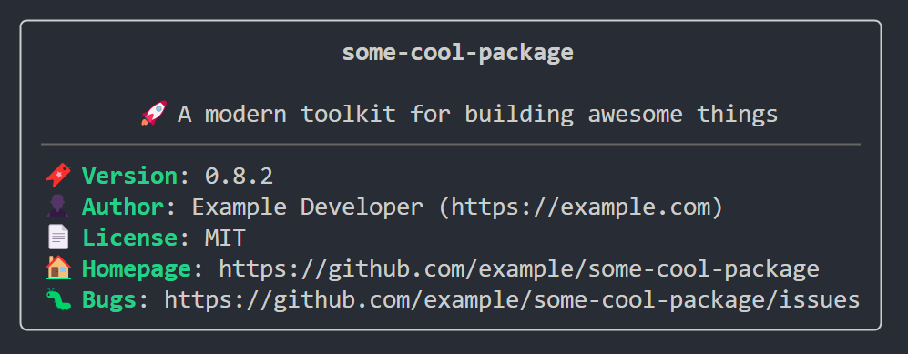

<!-- markdownlint-disable first-line-h1 -->
[](https://npmjs.com/package/aboutproject) [](https://github.com/cli-stuff/apr/actions/workflows/test.yml) [](https://github.com/vadimdemedes/ink) [](https://bun.sh) [](https://biomejs.dev/)

<!-- markdownlint-disable-next-line no-inline-html -->
<br>

<!-- markdownlint-capture -->
<!-- markdownlint-disable no-inline-html heading-start-left -->
<div align="center">
  <a href="https://github.com/cli-stuff/apr">
    
  </a>

  # apr

  > 📦 Elegant NPM package details in your terminal
</div>
<!-- markdownlint-restore -->

## 📥 Installation

```bash
bun i -g aboutproject
npm i -g aboutproject
yarn global add aboutproject
```

## 🚀 Usage

Just run `apr` in any directory containing a `package.json`:

```bash
apr
```

### 📸 Screenshot

<!-- markdownlint-disable-next-line no-inline-html -->


## ✨ Features

- 📦 Beautiful terminal UI
- 🎯 Shows package details at a glance
- 🔍 Displays version, author, license, and more
- 🎨 Colored output for better readability
- 🚀 Zero configuration needed

## ❤️ Support

If you like this project, consider supporting it by starring ⭐ it on GitHub, sharing it with your friends, or buying me a coffee ☕:

- <https://send.monobank.ua/jar/6rUVs4yasg>
- <https://donatello.to/okineadev>

## 🙏 Credits

Thanks to these packages, this project works:

- [ink](https://github.com/vadimdemedes/ink) - React for CLIs
- [ink-divider](https://github.com/JureSotosek/ink-divider) - Divider component for Ink

## 📝 License

MIT © [Okinea Dev](https://github.com/okineadev)
